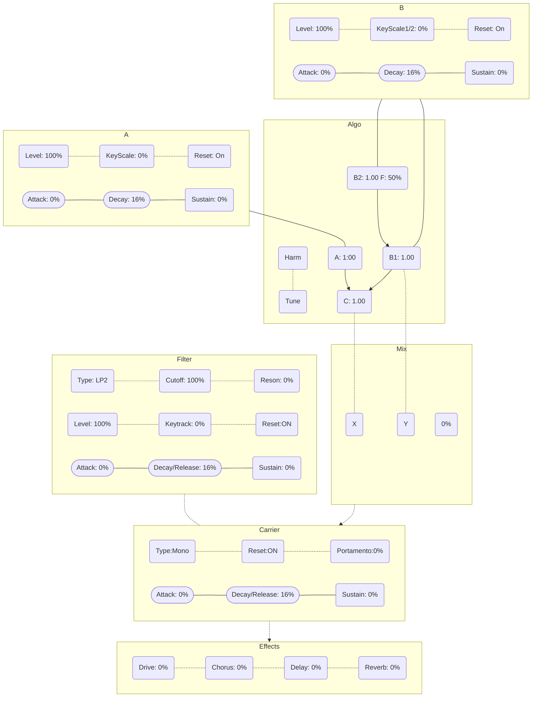

```mermaid
flowchart

subgraph A
alev(Level: 100%)-.-akey(KeyScale: 0%)-.-ares(Reset: On)
aa([Attack: 0%])---ad([Decay: 16%])---as(Sustain: 0%)
end

subgraph B
blev(Level: 100%)-.-bkey(KeyScale1/2: 0%)-.-bres(Reset: On)
ba([Attack: 0%])---bd([Decay: 16%])---bs(Sustain: 0%)
end

subgraph Carrier
ctype(Type:Mono)-.-cres(Reset:ON)-.-cport(Portamento:0%)
ca([Attack: 0%])---cd([Decay/Release: 16%])---cs(Sustain: 0%)
end

subgraph Effects
dr(Drive: 0%)-.-ch(Chorus: 0%)-.-de(Delay: 0%)-.-re(Reverb: 0%)
end

subgraph Filter
ftype(Type: LP2)-.-fcut(Cutoff: 100%)-.-freso(Reson: 0%)
flev(Level: 100%)-.-fk(Keytrack: 0%)-.-ft(Reset:ON)
fa([Attack: 0%])---fd([Decay/Release: 16%])---fs(Sustain: 0%)
end

subgraph Algo
h(Harm)-.-t(Tune)
bb(B2: 1.00 F: 50%)
b(B1: 1.00)
c(C: 1.00)
a(A: 1:00)

bb-->b
a-->c
b-->c
end
c-.-X
b-.-Y

A---a
B---b & bb
Filter-.-Carrier-.->Effects
Mix-.->Carrier

subgraph Mix
X(X)
am(0%)
Y(Y)
end
```
